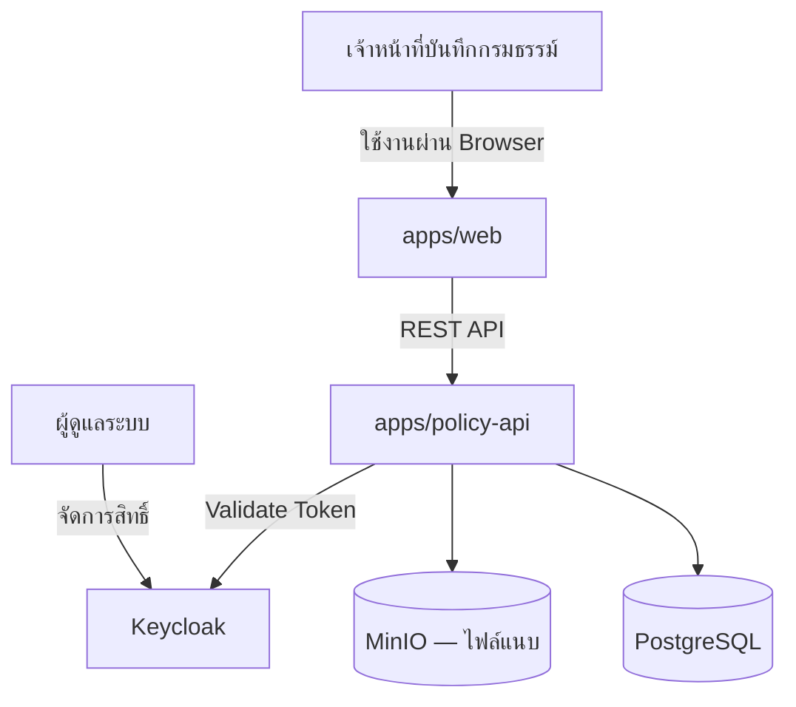

# System Context — VMI (ระบบบันทึกกรมธรรม์ภาคสมัครใจ)

> ระดับ C4 Model: System Context (Level 1)
> สถานะ: Draft — ปรับปรุงเมื่อ scope ของระบบเปลี่ยน

## Actors
- **เจ้าหน้าที่บันทึกกรมธรรม์ (Policy Officer)** — สร้าง/แก้ไข/ค้นหากรมธรรม์ภาคสมัครใจ, แนบเอกสาร
- **ผู้ดูแลระบบ (Admin)** — จัดการสิทธิ์ผู้ใช้งานผ่าน Keycloak
- TODO: เติม actor อื่นที่เกี่ยวข้อง (เช่น ฝ่ายบัญชี, ตัวแทน/นายหน้า) เมื่อ scope ชัดขึ้น

## System
**VMI (Voluntary Motor Insurance Online)** — ระบบบันทึกและจัดการกรมธรรม์ประกันภัยรถยนต์ภาคสมัครใจ

## External Systems (ปัจจุบัน)
- **Keycloak** — Authentication/Authorization (local SSO)
- **MinIO** — Object storage สำหรับไฟล์แนบ (ดู [ADR-0004](../adr/0004-store-attachments-in-s3.md))
- **PostgreSQL** — Primary datastore (ดู [ADR-0002](../adr/0002-use-postgresql.md))

## External Systems (แผนอนาคต — ยังไม่ implement)
- คปภ. / ระบบภายนอกที่ต้อง integrate — TODO: ระบุเมื่อทราบ requirement
- AWS S3 (แทน MinIO บน production)
- Cloudflare (CDN/WAF หน้า web)

## Diagram

TODO: ขยายเป็น Container diagram (C4 Level 2) เมื่อ `apps/web` และ `apps/policy-api` เริ่ม implement จริง
